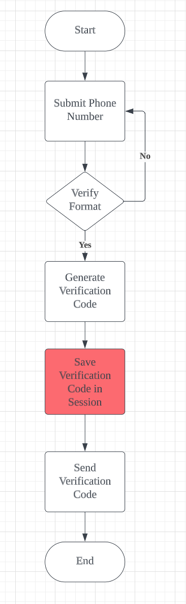
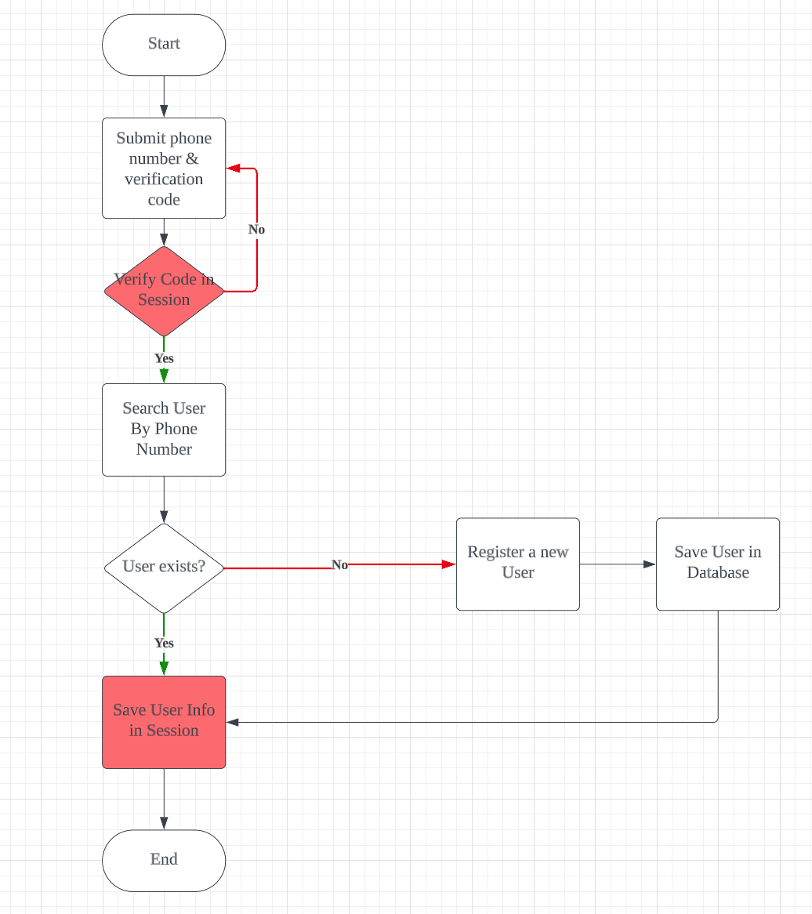
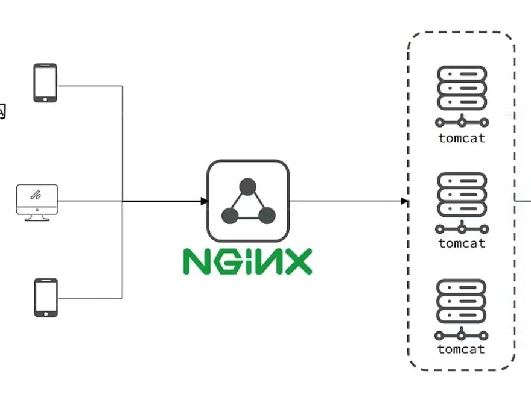
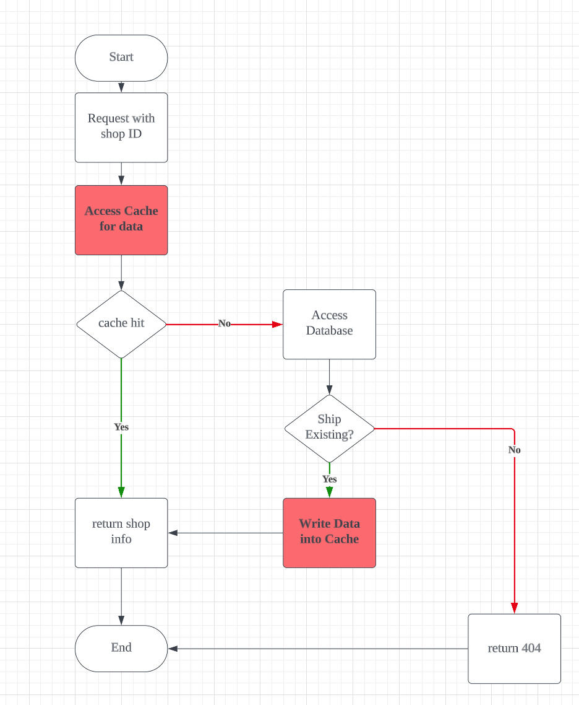
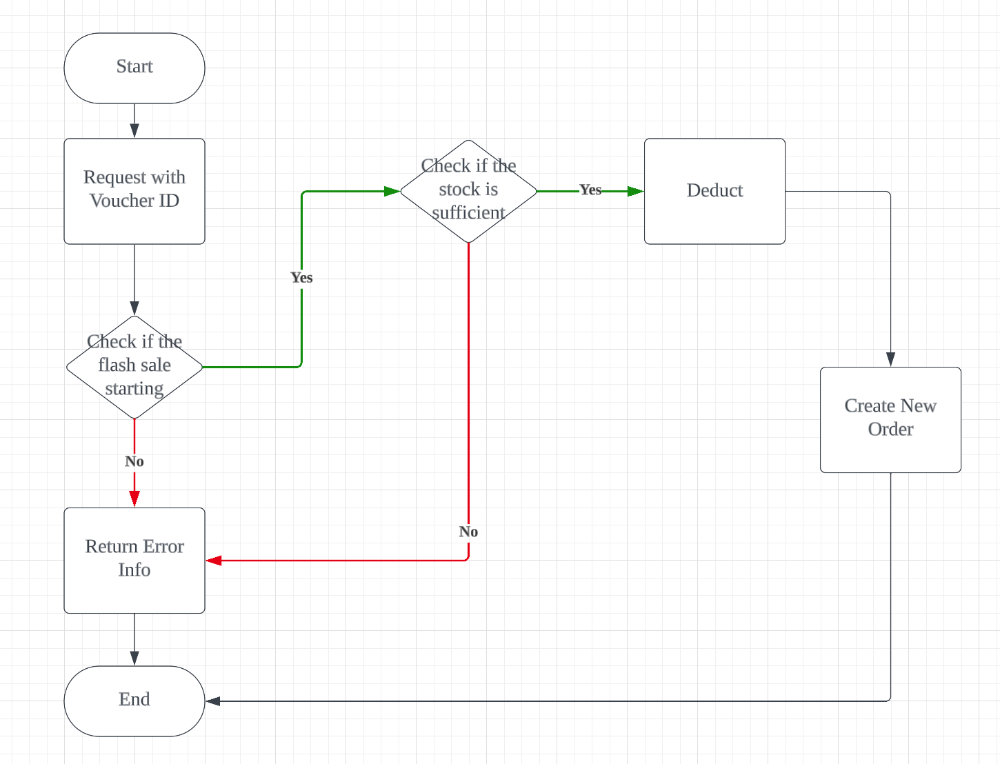
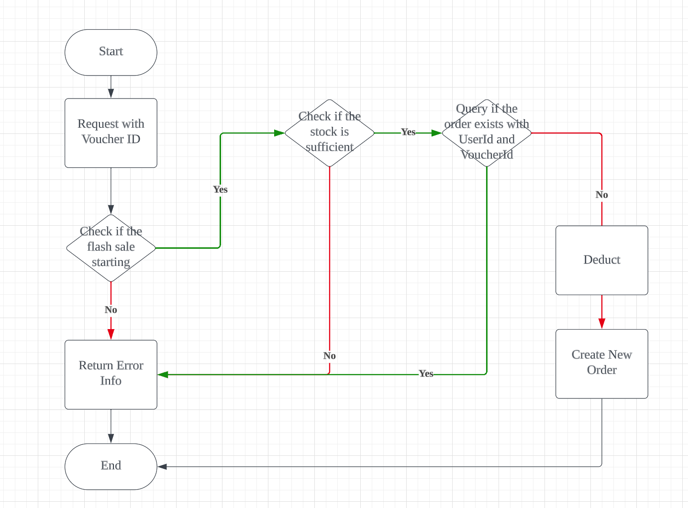

# A Yelp-like Application


# Login Module in monolith application 


The implementation of this module is in  

"com/hmdp/controller/OldUserController.java"       "com/hmdp/config/LoginInterceptor.java"

### Verification Code



1. When the user submits their phone number, the backend verifies the format of the number. If it's incorrect, the user is **prompted** to re-enter the phone number.

2. If the phone number format is valid, the backend generates an **associated verification code** and stores it in the user's session. This code is then sent to the user via SMS using an API provided by **the SMS service vendor.**


### Login && Register 




1. User submits the verification code and phone number.  Backend will compare  **code provided by the user**  with **code stored in session.** If not the same, then verification fails. 

2. If verification is successful, the backend checks if the user's information **already exists in the database**. If it doesn't, a new account is registered for the user.
3. The user's information is then stored in their session **for future reference**.


### Login Status 


For some requests, check whether the user has logged in or not. 

```
@Configuration
public class MvcConfig implements WebMvcConfigurer {

    @Resource
    private StringRedisTemplate stringRedisTemplate;

    @Override
    public void addInterceptors(InterceptorRegistry registry) {
        // login interceptor
        registry.addInterceptor(new LoginInterceptor())
                .excludePathPatterns(
                        "/shop/**",
                        "/voucher/**",
                        "/shop-type/**",
                        "/upload/**",
                        "/blog/hot",
                        "/user/code",
                        "/user/login"
                ).order(1);
   }             
}

```


* Why Using ThreadLocal here? 

**Decoupling**.  If we want to get the user info from session, for example in Spring, we need need pass **HttpSession** as **argument** in a function in controller.  However, nowadays In backend project, we use layer architecture,  we have like controller layer, service layer and Data Access layer,  if in service layer or data access layer, we need user info from session, we have to pass the value and explicit declare a parameter for the user info,  this will introduce complexity of code.   

But If we store the user info in  ThreadLocal in advance, we can in anywhere get user information easily like this:

```
class Service {
	ThreadLocal<User>  threadlocal;
	
	public void fun() {
			threadlocal.get();
	}
}
```


### The Problem of Session 

In a distributed system, every Tomcat HTTP server maintains its own copy of session data and by default, these servers do not share sessions. Consider a scenario where we have 3 Tomcat servers - A, B, and C. When a user first sends a login request to server A, and subsequently sends another request to server B, server B lacks the session information of the user. As a result, this request will be intercepted.



In the early days, the issue was addressed by using shared sessions among the servers. However, this solution had limitations:

1. Each Tomcat HTTP server holds a complete copy of session data, which could result in unnecessary space usage.
2. Synchronizing session data across servers could lead to latency issues.


Therefore, we've moved to using Redis to replace session handling. With Redis, the session data is centralized and can be accessed more efficiently by all the servers in the distributed system.


# Login Module in Distributed System 

### The Design of Key

* For **verification code**,   **key** is "login: phone ::#{phone_num}"    **value** is the generated verification code

  For example,      **key** is   login: phone :07709963123       **value** is  aseqe1

  

* For **user information**,   the key design is more complex 

  If we continue to use phone number as **unique identifier** for an individual user, then each request sent from frontend must include the user's phone number, this is not suitable. 

​       So the better solution is when the user login, backend generates a token for this user,  the token serves as **key** in Redis with the user's information as **value**. .  And then backend would return the token to frontend.  Consequently,  every subsequent/following request sent from the frontend would include this token.  

​       For example,      **key** is    login:token:8939a40d-fbda-4155-b9ae-b9b7be08c446     

​                                 **value** is    {"nickName":"default","icon":"","id":1011}


### The problem of interceptor


# Query Cache


### Cache data in Redis



1. For each query, the first step is to access the cache for data. If the required data is in the cache, it will be retrieved from the cache and returned
2. In case of a cache miss, the database will be accessed to check if the data exists. If it does not, a 404 error will be returned.
3. If the data is found in the database, it will be written into the cache and then returned.


### The cache update strategy

① Evict data until the memory is full.  We can choose different eviction policy.

② Expire time.  Set TTL for every data

③ Update by hand. 


For data consistency,  ①  is bad, ② is just-so so, ③  is best. 


For complexity,  ①  is easy, just let Redis do it.     ②  is just so so, because you need to think about TTL.   ③ is hard, you need to code carefully to prevent bugs.


**In this project we update cache by hand.**


### Caching Strategy 

1. Cache  Aside    2. Read/Write through   3. Write back


* Good to Read

  https://medium.com/@vijaynathv/caching-strategies-and-cache-eviction-policies-768351e25f1f

​       https://www.educative.io/answers/caching-patterns

### specific implementation 

**In this project, we choose cache aside strategy.**


The key implementation here is 

* Read Operation 

```
    public Result queryById(Long id) {
        // 1. access cache
        String key = RedisConstants.CACHE_SHOP_KEY + id;
        String shopJson = stringRedisTemplate.opsForValue().get(key);
        if (StrUtil.isNotBlank(shopJson)) {
            Shop shop = JSONUtil.toBean(shopJson, Shop.class);
            return Result.ok(shop);
        }

        // 2. if data not existing in cache, then access database
        Shop shop = getById(id);
        if (shop == null) {
            return Result.fail("The shop not existing");
        }

        // 3. put into cache
        stringRedisTemplate.opsForValue().set(RedisConstants.CACHE_SHOP_KEY + id, JSONUtil.toJsonStr(shop));
        return Result.ok(shop);
    }
```


* Write Operation 

```
    public Result update(Shop shop) {
        if (shop.getId() == null) {
            return Result.fail("id is null");
        }
        // 1. update database
        updateById(shop);

        // 2. delete associated data in cache
        stringRedisTemplate.delete(RedisConstants.CACHE_SHOP_KEY + shop.getId());

        return Result.ok();
    }
```


### ReidsCacheUtil

#### Issue: 1. Cache Penetration

**Scenario**:  if the data requested by client side does **not** exist in both cache and database,   then the cache will never be hit, all the request will be processed by database. 


 **Solutions:** 

① Cache the data that does not exist

​     Pros:  easy to develop and maintain 

​     Cons: extra memory needed in cache,     data inconsistency in short term 

② Bloom Filter 

​	 Pros: less memory needed in Cache

​     Cons: complex,        false positive 


#### Issue2:  Cache Avalanche

**Scenario** :    ① A large number of cache keys expire at the same time     ② Redis crashes down


**Solution**:

① set random value for TTL to avoid all cache keys expire at the same time.

② Using  cluster for Availability.


#### Issue3: Hotspot Invalid 

**Scenario**:    In a system with  high concurrency ,  if one hotspot key being invalid suddenly,  then countless requests will be passed to database. 


**Solution**: 

① Mutex lock.    Think such a scenario,  hundreds of requests are passed into server side,  so here are hundreds of threads.  When thread A access data and gets no data, it will access database,  and put the data into cache.  However, when A is doing this process (have not finished)  ,  thread B, C, D ,E .... will also access the cache, and gets no data,  consequently, hundreds of requests will still access database, which may lead to database crash down. 

To prevent this scenario, we use mutex to limit that only one thread can access database at a time.

To prevent a situation: Thread A does not go through whole procedure and the lock expires,   and then B thread acquire the lock,  but Thread A release the lock owned by Thread B.  Every time to lock, thread should generate a token to identify  the owner of lock.

```java
 // com/hmdp/utils/CacheClient.java
 
    public <R, ID> R queryWithMutex(String keyPrefix, ID id, Class<R> type, Function<ID, R> dbFallback, Long time, TimeUnit timeUnit) {
        String key = keyPrefix + id;
        String json = stringRedisTemplate.opsForValue().get(key);
        if (StrUtil.isNotBlank(json)) {
            return JSONUtil.toBean(json, type);
        }
        if (json.equals("")) {
            return null;
        }
        String lockKey = RedisConstants.LOCK_SHOP_KEY + id;
        R r = null;
        String token = RandomUtil.randomString(6);
        try {
            boolean flag = tryLock(lockKey, token);
            // fail to acquire lock, sleep
            if (!flag) {
                Thread.sleep(50);
                return queryWithMutex(keyPrefix, id, type, dbFallback, time, timeUnit);
            }
            // get lock
            r = dbFallback.apply(id);
            if (r == null) {
                // set blank value into cache to prevent Cache Penetration
                stringRedisTemplate.opsForValue().set(key, "", RedisConstants.CACHE_NULL_TTL, TimeUnit.MINUTES);
                return null;
            }
            this.set(key, r, time, timeUnit);
        } catch (InterruptedException e) {
            throw new RuntimeException(e);
        } finally {
            unlock(lockKey, token);
        }
        return r;
    }

    private boolean tryLock(String key, String value) {
        Boolean flag = stringRedisTemplate.opsForValue().setIfAbsent(key, value, 10, TimeUnit.SECONDS);
        return flag;
    }

    private void unlock(String key, String value) {
        String v = stringRedisTemplate.opsForValue().get(key);
        if (value.equals(v)) {
            stringRedisTemplate.delete(key);
            return;
        }
    }
```


② Logical Expiration.


# Global Unique ID


### Global Unique ID Generator 

* Why we need a **global ID** rather then **auto-increment ID**

1. Database Partitioning:  When using **auto-increment ID** in a database table, a problem can arise if we need to perform **vertical partitioning** on that table. Different sub-tables may end up with conflicting IDs, as each partition would continue the auto-increment sequence independently, potentially leading to duplicates
2. Using auto-increment IDs for items in our database could  **expose** **sensitive business information.**   For example, a competitor could estimate the total number of items we've sold by simply observing the incrementing IDs.


### Implementation 

The key implementation is Redis  **increment()** method. 


```java
  // com/hmdp/utils/RedisIdWorker.java

public long nextId(String keyPrefix) {
        // 1. generate timestamp
        LocalDateTime now = LocalDateTime.now();
        long nowSecond = now.toEpochSecond(ZoneOffset.UTC);
        long timestamp = nowSecond - BEGIN_TIMESTAMP;

        // 2. Get today
        String date = now.format(DateTimeFormatter.ofPattern("yyyy:MM:dd"));

        // 3. auto-increment
        Long count = stringRedisTemplate.opsForValue().increment("icr:" + keyPrefix + ":" + date);

        return timestamp << COUNT_BITS | count;
    }
```


### Test


```java
  //com/hmdp/IdWorkerTest.java

		@Test
    void testIdWorker() throws InterruptedException {
        ExecutorService es = Executors.newFixedThreadPool(32);
        CountDownLatch latch = new CountDownLatch(300);
        Runnable task = () -> {
            for (int i = 0; i < 100; i++) {
                long id = redisIdWorker.nextId("order");
                System.out.println("id = " + id);
            }
            latch.countDown();
        };
        long begin = System.currentTimeMillis();
        for (int i = 0; i < 300; i++) {
            es.submit(task);
        }
        latch.await();
        long end = System.currentTimeMillis();
        System.out.println("time = " + (end - begin));
    }
```


# Voucher Module 

Many Chinese e-commerce apps often host flash sale events featuring limited-quantity vouchers. These events usually last for just a few minutes. Customers must stay attentive and act fast, as they compete with each other to get these vouchers at the moment the event begins. 

Such events require the system to be capable of handling high levels of concurrency.


### Easiest Implementation with Race Condition 


* WorkFlow



1. Check if the flash sale event has started or ended. 
2. Check if the stock is sufficient.


* Race condition Issues

If we do not control the concurrency,  the **oversold issue** may occur. 

For instance, consider two threads: Thread A and Thread B. Now, let's say there's only one item remaining in the stock. Both threads concurrently check the stock and find that there is one item available. Subsequently, they both proceed to deduct the stock and create a new order. As a result, the single item gets oversold, creating a problem due to this race condition


### Race Condition Solution 

* Pessimistic Lock

Using `synchronized` or `lock `

* Optimistic Lock

```sql
Update t_voucher set stock = stock - 1 where id = ? and stock > 0 
```


### Further one step:  One user can only get one voucher



In addition to above logic,  after checking the stock,  we still need to check if the user has got the voucher, if so, the user can not create an order again.


However, a new issue occurs, still race condition:  Think about concurrency,  a user send multiple requests to get voucher at the same time.  Then multiple threads will query the order and find no order created. Consequently, the user will still get multiple voucher and create multiple orders.


### Solution 

1. Coarse granularity.   Use `synchronized` when checking if the order exists.            																				 Just pseudo code

```java
public Result getVoucher() {
  
    1. check if the event started or not 
    2. check if the event ended or not
    3. check if the stock is sufficient
    4. createOrder();
}


@Transactional
public synchronized Result createOrder() {
    1. check if order exists. Yes: return errors 
    2. Deduct
    3. Create Order
}
```

However, in this way,  the performance will be very bad, as all requests have to be processed sequentially,  even though they are for different types of vouchers  or  from different user.


2. Fine Granularity. By analysis we can know that, we should control concurrency at user-level, so we should lock for every user rather then the whole system.

   The key implementation here is we use `intern()` ,  so the String will be got from JVM String Pool, which is unique object.  

```java
@Transactional
public Result createOrder() {
    Long userId = getUserId();
    synchronized (userId.toString().intern() ){
    1. check if order exists. Yes: return errors 
    2. Deduct
    3. Create Order
    }
}
```


