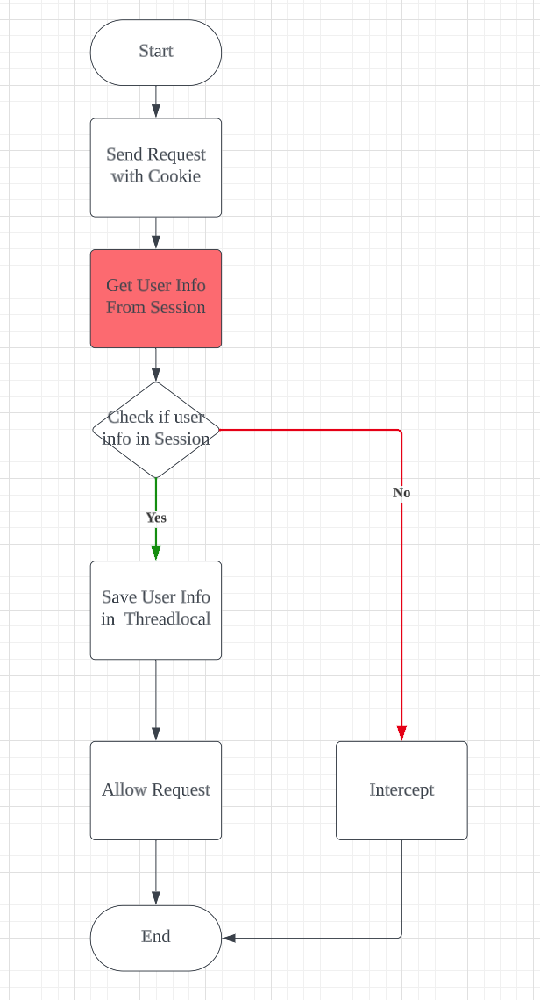

# A Yelp-like Application


# Login Module in monolith application 

### Verification Code


1. When the user submits their phone number, the backend verifies the format of the number. If it's incorrect, the user is **prompted** to re-enter the phone number.

2. If the phone number format is valid, the backend generates an **associated verification code** and stores it in the user's session. This code is then sent to the user via SMS using an API provided by **the SMS service vendor.**


### Login && Register 


1. User submits the verification code and phone number.  Backend will compare  **code provided by the user**  with **code stored in session.** If not the same, then verification fails. 

2. If verification is successful, the backend checks if the user's information **already exists in the database**. If it doesn't, a new account is registered for the user.
3. The user's information is then stored in their session **for future reference**.


### Login Status 



For some requests, check whether the user has logged in or not. 

```
@Configuration
public class MvcConfig implements WebMvcConfigurer {

    @Resource
    private StringRedisTemplate stringRedisTemplate;

    @Override
    public void addInterceptors(InterceptorRegistry registry) {
        // login interceptor
        registry.addInterceptor(new LoginInterceptor())
                .excludePathPatterns(
                        "/shop/**",
                        "/voucher/**",
                        "/shop-type/**",
                        "/upload/**",
                        "/blog/hot",
                        "/user/code",
                        "/user/login"
                ).order(1);
   }             
}

```


* Why Using ThreadLocal here? 

**Decoupling**.  If we want to get the user info from session, for example in Spring, we need need pass **HttpSession** as **argument** in a function in controller.  However, nowadays In backend project, we use layer architecture,  we have like controller layer, service layer and Data Access layer,  if in service layer or data access layer, we need user info from session, we have to pass the value and explicit declare a parameter for the user info,  this will introduce complexity of code.   

But If we store the user info in  ThreadLocal in advance, we can in anywhere get user information easily like this:

```
class Service {
	ThreadLocal<User>  threadlocal;
	
	public void fun() {
			threadlocal.get();
	}
}
```


### The Problem of Session 

In a distributed system, every Tomcat HTTP server maintains its own copy of session data and by default, these servers do not share sessions. Consider a scenario where we have 3 Tomcat servers - A, B, and C. When a user first sends a login request to server A, and subsequently sends another request to server B, server B lacks the session information of the user. As a result, this request will be intercepted.


In the early days, the issue was addressed by using shared sessions among the servers. However, this solution had limitations:

1. Each Tomcat HTTP server holds a complete copy of session data, which could result in unnecessary space usage.
2. Synchronizing session data across servers could lead to latency issues.


Therefore, we've moved to using Redis to replace session handling. With Redis, the session data is centralized and can be accessed more efficiently by all the servers in the distributed system.


# Login Module  in Distributed System 
